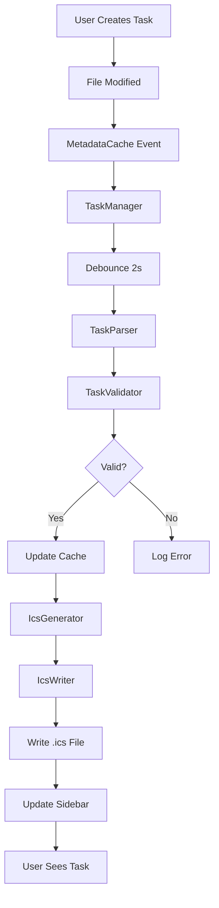

# Task-alavista Architecture Overview

## Project Vision

Task-alavista transforms Obsidian tasks into calendar events, bridging the gap between note-taking and time management. Users tag tasks with `#schedule`, and the plugin automatically generates a subscribable `.ics` file for seamless integration with any calendar application.

---

## Core Architecture

### Module Organization

```
task-alavista/
├── src/
│   ├── main.ts                    # Plugin entry point & lifecycle
│   ├── settings/                  # Configuration management
│   │   ├── PluginSettings.ts      # Settings interface & defaults
│   │   └── SettingsTab.ts         # Settings UI
│   ├── parser/                    # Task extraction & validation
│   │   ├── types.ts               # Task-related types
│   │   ├── TaskParser.ts          # RegEx-based parsing
│   │   └── TaskValidator.ts       # Validation logic
│   ├── calendar/                  # ICS generation & file I/O
│   │   ├── types.ts               # Calendar event types
│   │   ├── IcsGenerator.ts        # RFC 5545 ICS format
│   │   └── IcsWriter.ts           # File system operations
│   ├── ui/                        # User interface components
│   │   ├── SidebarView.ts         # Right pane task list
│   │   └── styles.css             # Component styles
│   ├── core/                      # Central coordination
│   │   ├── TaskManager.ts         # Orchestrates all modules
│   │   └── DeepLinkGenerator.ts   # obsidian:// URI creation
│   └── utils/                     # Shared utilities
│       ├── debounce.ts            # Debounce helper
│       └── dateParser.ts          # Date/time utilities
```

---

## Data Flow Architecture



---

## Key Design Decisions

### 1. Strict Task Format (v1.0)

**Format**: `- [ ] #schedule YYYY-MM-DD HH:MM "Title" [duration:Xh|Xm] [location:"Place"] [reminder:Xm]`

**Rationale**:
- Predictable parsing with RegEx
- Clear error messages for malformed tasks
- Foundation for future NLP enhancement

**Example**:
```markdown
- [ ] #schedule 2026-04-15 14:00 "Team Meeting" duration:1h location:"Room A" reminder:15m
```

### 2. Debounced Updates

**Implementation**: 2-second delay (configurable)

**Rationale**:
- Prevents excessive file writes during rapid editing
- Reduces performance impact on large vaults
- Balances responsiveness with efficiency

### 3. MetadataCache Integration

**Strategy**: Event-driven file monitoring

**Rationale**:
- Leverages Obsidian's built-in caching system
- Only re-parses modified files
- Scales efficiently with vault size

### 4. Completed Task Behavior

**Default**: Remove from `.ics` when checked

**Configurable Options**:
- Remove (default)
- Keep and mark as completed
- Archive to separate section

**Rationale**: User preference varies; flexibility is key

---

## Module Responsibilities

### [`main.ts`](src/main.ts)
- Plugin lifecycle management ([`onload()`](src/main.ts), [`onunload()`](src/main.ts))
- Initialize [`TaskManager`](src/core/TaskManager.ts)
- Register commands and views
- Load/save settings

### [`TaskManager`](src/core/TaskManager.ts)
- Central orchestrator for all operations
- Listens to [`MetadataCache`](https://docs.obsidian.md/Reference/TypeScript+API/MetadataCache) events
- Coordinates parsing, validation, and ICS generation
- Manages in-memory task cache

### [`TaskParser`](src/parser/TaskParser.ts)
- Extracts `#schedule` tasks from markdown
- Uses RegEx for strict format matching
- Returns structured [`ScheduledTask`](src/parser/types.ts) objects

### [`TaskValidator`](src/parser/TaskValidator.ts)
- Validates parsed task data
- Checks date/time validity
- Ensures required fields are present

### [`IcsGenerator`](src/calendar/IcsGenerator.ts)
- Converts [`ScheduledTask[]`](src/parser/types.ts) to ICS format
- Follows RFC 5545 standard
- Includes deep links in event descriptions

### [`IcsWriter`](src/calendar/IcsWriter.ts)
- Writes ICS content to file system
- Uses Obsidian's [`Vault`](https://docs.obsidian.md/Reference/TypeScript+API/Vault) API
- Handles errors and retries

### [`SidebarView`](src/ui/SidebarView.ts)
- Displays scheduled tasks in right pane
- Extends [`ItemView`](https://docs.obsidian.md/Reference/TypeScript+API/ItemView)
- Provides filtering and sorting

### [`DeepLinkGenerator`](src/core/DeepLinkGenerator.ts)
- Creates `obsidian://open` URIs
- Encodes vault name, file path, and line number
- Enables calendar → Obsidian navigation

---

## Performance Considerations

### Efficient File Monitoring
- **Don't**: Read entire vault on every change
- **Do**: Use [`MetadataCache`](https://docs.obsidian.md/Reference/TypeScript+API/MetadataCache) to track only modified files
- **Do**: Cache parsed tasks in memory
- **Do**: Only re-parse files that changed

### Memory Management
- Clear cache for deleted files
- Limit cache size (max 1000 tasks)
- Use WeakMap for file references where possible

### Debounced Updates
- Configurable delay (default: 2000ms)
- Cancel pending updates if new changes arrive
- Batch multiple changes into single ICS write

---

## Deep Linking

### Format
```
obsidian://open?vault={vaultName}&file={filePath}&line={lineNumber}
```

### Implementation
1. Extract vault name from [`Vault.getName()`](https://docs.obsidian.md/Reference/TypeScript+API/Vault/getName)
2. URL-encode file path
3. Include line number for precise navigation
4. Embed in ICS `DESCRIPTION` and `URL` fields

### Example
```
obsidian://open?vault=MyVault&file=Projects%2FQ2%20Planning.md&line=42
```

---

## Settings Schema

```typescript
interface PluginSettings {
  icsPath: string;              // Default: .obsidian/plugins/task-alavista/schedule.ics
  debounceDelay: number;        // Default: 2000ms
  completedBehavior: 'remove' | 'keep' | 'archive';  // Default: remove
  defaultReminderMinutes: number;  // Default: 15
  dateFormat: string;           // Default: YYYY-MM-DD
}
```

---

## Error Handling Strategy

### Parsing Errors
- Log to console with file path and line number
- Display warning in sidebar (optional)
- Continue processing other tasks

### File System Errors
- Retry ICS write on failure (max 3 attempts)
- Notify user if persistent failure
- Fallback to alternative path if configured

### Validation Errors
- Reject tasks with invalid dates
- Provide clear error messages in UI
- Allow user to fix and re-parse

---

## Testing Strategy

### Unit Tests
- Task parser with various input formats
- ICS generator output validation
- Date/time parsing edge cases
- Deep link generation

### Integration Tests
- End-to-end: task creation → ICS generation
- File modification → cache update
- Settings changes → behavior updates

### Manual Testing
- Test with real Obsidian vault
- Verify calendar app subscription
- Test deep links in Apple Calendar

---

## Future Enhancements (Post v1.0)

1. **NLP Parsing**: Optional natural language task parsing
2. **Recurring Events**: Support for repeating tasks
3. **Multi-vault**: Separate ICS files per vault
4. **Sync Status**: Visual indicator of last sync time
5. **Task Templates**: Quick insert via command palette
6. **Conflict Resolution**: Handle duplicate UIDs gracefully
7. **Export Options**: Additional calendar formats

---

## Dependencies

### Production
- `obsidian`: ^1.5.0 (provided by Obsidian)
- `date-fns`: ^3.0.0 (date parsing and formatting)

### Development
- `typescript`: ^5.3.0
- `esbuild`: ^0.19.0
- `@typescript-eslint/eslint-plugin`: ^6.0.0
- `@typescript-eslint/parser`: ^6.0.0
- `eslint`: ^8.0.0
- `prettier`: ^3.0.0

---

## Build Process

1. **Development**: `npm run dev` (watch mode with esbuild)
2. **Production**: `npm run build` (minified bundle)
3. **Linting**: `npm run lint` (ESLint + Prettier check)
4. **Format**: `npm run format` (Auto-fix with Prettier)

---

## Git Workflow

### Conventional Commits
- `feat:` New features
- `fix:` Bug fixes
- `docs:` Documentation changes
- `style:` Code style changes
- `refactor:` Code refactoring
- `test:` Test additions/changes
- `chore:` Build process, dependencies

### Branch Strategy
- `main`: Stable releases
- `develop`: Integration branch
- `feature/*`: New features
- `fix/*`: Bug fixes

---

## License

MIT License - Open source and community-driven.